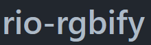

<div align= "center">

</div>


<div align= "center">
 <h1>WebGISdata</h1>
 <a href="https://gdal.org/">
    
</a>
<a href="https://github.com/mapbox/mbutil">
    
</a>
 <a href="https://github.com/mapbox/tippecanoe">
    
 </a>
 <a href="https://github.com/osmcode/osmium-tool">
    
</a>

<a href="https://github.com/mapbox/rio-rgbify">
    
</a>

<a href="https://github.com/systemed/tilemaker">
    
</a>
</div>

<h4 align="center">WebGISdata 是</a> 使用开源GIS技术的地图瓦片生成解决方案. </h4>

构建[mbtiles格式](https://github.com/studentdsx/mbtiles-spec)的矢量瓦片、栅格瓦片、地形瓦片以及使用OSM数据构建瓦片. 在数据处理过程中,  最难的是安装各种环境, 现在整合了一个[Docker镜像](https://hub.docker.com/repository/docker/dxnima/webgisdata), 包括 [GDAL](https://gdal.org/) | [tippecanoe](https://github.com/mapbox/tippecanoe) | [mbutil](https://github.com/mapbox/mbutil) | [osmium](https://github.com/osmcode/osmium-tool) | [rio-rgbify](https://github.com/mapbox/rio-rgbify) |  [tilemaker](https://github.com/systemed/tilemaker) 这些环境.

## 项目地址

- Gitee地址: https://gitee.com/dxnima/WebGISdata.git
- Github地址: https://github.com/DXnima/WebGISdata.git

## 开源技术

|                      开源工具                      |                          说明                           |
| :------------------------------------------------: | :-----------------------------------------------------: |
|             [GDAL](https://gdal.org/)              |      一个栅格数据和矢量数据地理空间数据格式转换库       |
| [tippecanoe](https://github.com/mapbox/tippecanoe) |       大量从 GeoJSON 要素集合构建mbtiles矢量切片        |
|     [mbutil](https://github.com/mapbox/mbutil)     |          用于导入和导出 MBTiles 格式的实用程序          |
|  [osmium](https://github.com/osmcode/osmium-tool)  | 一个多用途的命令行工具, 用于处理基于OpenStreetMap的数据 |
| [rio-rgbify](https://github.com/mapbox/rio-rgbify) |         将DEM地形影像转 Terrain-RGB 格式的影像          |
| [tilemaker](https://github.com/systemed/tilemaker) |  从OpenStreetMap制作openmaptiles规范的mbtiles矢量瓦片   |

## 你将学会

- [x] 矢量瓦片制作
  - [x] 矢量数据转geojson
  - [x] geojson转mbtiles矢量瓦片
- [x] 栅格瓦片制作
  - [x] 影像数据处理
  - [x] 影像转mbtiles栅格瓦片
  - [x] DEM影像数据处理
  - [x] DEM影像转mbtiles栅格瓦片
- [x] OSM矢量瓦片制作
  - [x] OSM数据处理
  - [x] OSM数据转openmaptiles规范的mbtiles矢量瓦片

## 如何开始

### 1. Docker Hub拉取镜像安装

```shell
# 拉取镜像
docker pull dxnima/webgisdata
# 使用容器
docker run -it --rm -v \
      /待处理数据的路径:/data \
      dxnima/webgisdata \
      你的命令
```

### 2. 自行创建镜像并安装
```shell
git clone https://gitee.com/dxnima/WebGISdata.git
# git clone https://github.com/DXnima/WebGISdata.git
cd WebGISdata
# 构建镜像
docker build -f Dockerfile -t dxnima/webgisdata .
# 使用容器
docker run -it --rm -v \
      /待处理数据的路径:/data \
      dxnima/webgisdata \
      你的命令
```

### 3. 容器环境说明

|    软件    |  版本  |
| :--------: | :----: |
|    GDAL    | 3.5.2  |
|   Python   | 3.8.10 |
| tippecanoe | 1.36.0 |
|   mbutil   | 0.3.0  |
| rio-rgbify | 1.3.9  |
| tilemaker  | 2.4.0  |
|  ogr2osm   | 1.2.0  |

### 4. 使用容器

#### 命令拼接使用容器

```shell
# 命令拼接使用容器
docker run -it --rm -v \
      /待处理数据的路径:/data \
      dxnima/webgisdata \
      你的命令
```

#### 进入容器使用命令

进入容器后相当于一个linux系统, 可以正常使用linux系统命令进行操作.

```shell
# 进入容器内部
docker run -it --rm -v /待处理数据的路径:/data dxnima/webgisdata
# 进入容器后相当于一个linux系统
root@f7865dcb49d0:/data# 你的命令
```

## 如何使用

### 1. 矢量瓦片制作

制作矢量瓦片, 源数据格式要求为**EPSG:3857**坐标系的**geojson格式**的矢量数据；因此对其他格式需要先进行坐标系转换和格式转换

#### 1. 坐标系转换

主要使用**ogr2ogr**命令实现, 详细说明文档: [https://www.osgeo.cn/gdal/programs/ogr2ogr.html](https://www.osgeo.cn/gdal/programs/ogr2ogr.html)

1. 将shp文件的EPSG:4326转EPSG:3857命令如下:

```shell
docker run -it --rm -v \
      /待处理数据的路径:/data \
      dxnima/webgisdata \
      ogr2ogr -s_srs EPSG:4326 -t_srs EPSG:3857 -f "ESRI Shapefile" /data/output.shp /data/input.shp
```

2. 将geojson文件的EPSG:4326转EPSG:3857命令如下:

```shell
docker run -it --rm -v \
      /待处理数据的路径:/data \
      dxnima/webgisdata \
      ogr2ogr -s_srs EPSG:4326 -t_srs EPSG:3857 -f "GeoJSON" /data/output.geojson /data/input.geojson
```

以此类推, 可以实现任何坐标系的任何格式的矢量数据转到EPSG:3857坐标系下.

#### 2. 矢量数据转geojson

主要使用**ogr2ogr**命令实现, 详细说明文档: [https://www.osgeo.cn/gdal/programs/ogr2ogr.html](https://www.osgeo.cn/gdal/programs/ogr2ogr.html).

1. 将有中文属性的shp转为geojson

```shell
docker run -it --rm -v \
      /待处理数据的路径:/data \
      dxnima/webgisdata \
      ogr2ogr -lco encoding=UTF-8 -f "GeoJSON" /data/output.geojson /data/input.shp
```

2. 将KML转为geojson

```shell
docker run -it --rm -v \
      /待处理数据的路径:/data \
      dxnima/webgisdata \
      ogr2ogr -f "GeoJSON" /data/output.geojson /data/input.kml
```

3. 将MapInfo转为geojson

```shell
docker run -it --rm -v \
      /待处理数据的路径:/data \
      dxnima/webgisdata \
      ogr2ogr -f "GeoJSON" /data/output.geojson /data/input.tab
```

4. 将postgres指定表数据转geojson

```shell
#指定表转GeoJSON
docker run -it --rm -v dxnima/webgisdata ogr2ogr -f "GeoJSON" tablename.geojson PG:"host=localhost dbname=dbname user=postgres password=password" "tablename"
```

以此类推, 可以实现任何格式的矢量数据转为geojson文件.

#### 3. geojson转mbtiles 

要使用tippecanoe实现, 说明文档见: [https://github.com/mapbox/tippecanoe](https://github.com/mapbox/tippecanoe)

1. 生成0~15级矢量瓦片命令

```shell
docker run -it --rm -v \
      /待处理数据的路径:/data \
      dxnima/webgisdata \
      tippecanoe -f -z15 -Z0 -o /data/output.mbtiles /data/input.json
```

2. 多文件生成矢量瓦片命令

```shell
docker run -it --rm -v \
      /待处理数据的路径:/data \
      dxnima/webgisdata \
      sh -c 'find /data -type f \( -name "*.json" -o -name "*.geojson" \) -exec tippecanoe -f -z15 -Z0 -o /data/output.mbtiles {} +'
```

### 2. 栅格瓦片制作

#### 1. 坐标系转换

主要使用**gdalwarp**命令实现, 说明文档见: [https://www.osgeo.cn/gdal/programs/gdalwarp.html](https://www.osgeo.cn/gdal/programs/gdalwarp.html)


将EPSG:4326坐标系的tif格式影像转为EPSG:3857坐标系的影像, 命令如下:

```shell
docker run -it --rm -v \
      /待处理数据的路径:/data \
      dxnima/webgisdata \
      gdalwarp -s_srs "EPSG:4326" -t_srs "EPSG:3857" /data/input.tif /data/output.tif
```

以此类推实现其他坐标系影像的转换.

#### 2. 影像处理

在影像切片之前, 需要确保影像为**8bit**, 不然GDAL切片会报错; 主要使用**gdal_translate**命令实现, 说明文档: [https://www.osgeo.cn/gdal/programs/gdal_translate.html](https://www.osgeo.cn/gdal/programs/gdal_translate.html)

1. 例如将某影像转8bit命令

```shell
docker run -it --rm -v \
      /待处理数据的路径:/data \
      dxnima/webgisdata \
      gdal_translate -ot Byte /data/input.tif /data/output.tif
```

2. 例如转8bit并将像素转为0.1

```shell
docker run -it --rm -v \
      /待处理数据的路径:/data \
      dxnima/webgisdata \
      gdal_translate -ot Byte -tr 0.1 0.1 /data/input.tif /data/output.tif
```

#### 3. DEM影像处理

1. 清除无数据的负值

MapBox支持的地形瓦片是**Terrain-RGB格式**, 其无法表示负值, 需要使用**gdalwarp**进一步处理: 

```shell
docker run -it --rm -v \
      /待处理数据的路径:/data \
      dxnima/webgisdata \
      gdalwarp -t_srs "EPSG:3857" -dstnodata None -co TILED=YES -co COMPRESS=DEFLATE -co BIGTIFF=IF_NEEDED /data/input.tif /data/output.tif
```

1. 转MaoBox格式地形瓦片

MapBox支持的地形是Terrain-RGB格式, 用3个byte通过rgb三通道来表示高程, 其转换公式为: `height = -10000 + ((R * 256 * 256 + G * 256 + B) * 0.1)`, 使用**rio-rgbify**实现转换命令如下, 详细说明文档: [https://github.com/mapbox/rio-rgbify](https://github.com/mapbox/rio-rgbify) 

```shell
docker run -it --rm -v \
      /待处理数据的路径:/data \
      dxnima/webgisdata \
      rio rgbify -b -10000 -i 0.1 /data/input.tif /data/output_rgb.tif
```

#### 4. 影像切片

1. 影像直接转切片

影像直接转mbtiles主要使用命令**gdal_translate**, 该方法实际上是构建金字塔, 此方法无法自定义切片zoom范围, zoom范围跟影像的像素大小有关. 
说明文档: [https://www.osgeo.cn/gdal/programs/gdal_translate.html](https://www.osgeo.cn/gdal/programs/gdal_translate.html)

- 影像转mbtiles, 此方法只会构建最大等级的mbtiles切片, 需要第二步向上构建金字塔
```shell
docker run -it --rm -v \
      /待处理数据的路径:/data \
      dxnima/webgisdata \
      gdal_translate -of MBTiles /data/input.tif /data/output.mbtiles
```

- mbtiles向上构建金字塔

使用**gdaladdo**命令完成, 说明文档: [https://www.osgeo.cn/gdal/programs/gdaladdo.html](https://www.osgeo.cn/gdal/programs/gdaladdo.html)

```shell
docker run -it --rm -v \
      /待处理数据的路径:/data \
      dxnima/webgisdata \
      gdaladdo -r nearest /data/output.mbtiles
```

**提示**: gdal_translate还可以通过 `-co <NAME=VALUE>` 控制输出瓦片的格式, 等其他命令操作, 例如生成png8格式的mbtiles栅格瓦片, 命令如下: 

```shell
docker run -it --rm -v \
      /待处理数据的路径:/data \
      dxnima/webgisdata \
      gdal_translate -of MBTiles -co "TILE_FORMAT =PNG8" /data/input.tif /data/output.mbtiles
```

2. 影像转切片碎片再转mbtiles

此方法支持自定义切片zoom范围, 但zoom切片越多, 需要时间越长. 

- 影像转碎瓦片

主要使用命令**gdal2tiles.py**, 详细说明文档: [https://www.osgeo.cn/gdal/programs/gdal2tiles.html](https://www.osgeo.cn/gdal/programs/gdal2tiles.html)

例如: 影像生成0~15级的切片命令如下: 

```shell
docker run -it --rm -v \
      /待处理数据的路径:/data \
      dxnima/webgisdata \
      gdal2tiles.py -z 0-15 -r near --xyz /data/input.tif /data/outdir
```

- 碎瓦片转mbtiles

第一步生成的碎瓦片都在outdir文件夹内, 使用**mb-util**工具实现碎瓦片文件转mbtiles, 转换前需要在outdir文件夹下创建**metadata.json**文件, 详细说明文档: [https://github.com/mapbox/mbutil](https://github.com/mapbox/mbutil)

```javascript
{
    "name": "tif_tiles", //名称
    "type": "overlay", //图层类型 可选 baselayer、overlay
    "description": " tif_tiles", //别名
    "version": "1.1", //版本
    "format": "png", //瓦片格式, 栅格瓦片可选png、png8、jpeg
    "minzoom": 0, //最小等级, 根据生成的范围填写
    "maxzoom": 15  //最大等级, 根据生成的范围填写
}
```

运行下面命令生成mbtiles: 

```shell
docker run -it --rm -v \
      /待处理数据的路径:/data \
      dxnima/webgisdata \
      mb-util /data/outdir /data/output.mbtiles
```

### 3. OSM矢量瓦片制作

#### 1. 下载OSM数据

OSM数据下载地址: [https://download.geofabrik.de/asia](https://download.geofabrik.de/asia)

全球海洋数据下载地址: [https://osmdata.openstreetmap.de/data/water-polygons.html](https://osmdata.openstreetmap.de/data/water-polygons.html)

#### 2. OSM数据处理

1. shp转osm

如果需要加入自定义数据, 可以根据需要将自定义shp数据导入osm, 使用**ogr2osm**实现, 详细说明文档: [https://github.com/roelderickx/ogr2osm](https://github.com/roelderickx/ogr2osm)

转换input.shp为output.osm, 并定义图层为layerName, 且排除字段attribute1,attribute2:

```shell
docker run -it --rm -v \
      /待处理数据的路径:/data \
      dxnima/webgisdata \
      ogr2osm input.shp -o output.osm -nln layerName -e attribute1,attribute2
```

2. OSM数据合并

当并不想使用全球的OSM数据, 请使用**osmium**进行合并, 详细说明文档: [https://osmcode.org/osmium-tool/manual.html](https://osmcode.org/osmium-tool/manual.html)

```shell
docker run -it --rm -v \
      /待处理数据的路径:/data \
      dxnima/webgisdata \
      osmium merge /data/china-latest.osm.pbf -o china.all.pbf
```

3. 设置数据边界

对OSM设置中国范围的bbox, 使用**osmium**进行处理:

```shell
docker run -it --rm -v \
      /待处理数据的路径:/data \
      dxnima/webgisdata \
      osmium extract --bbox=73.41788,14.27437,134.8559,53.65559 --set-bounds --strategy=smart /data/china.all.pbf --output /data/china.pbf
```

#### 3. OSM转mbtiles矢量瓦片

使用OSM生成openmaptiles规范的矢量瓦片数据，请前往下载 [config-openmaptiles.json](https://github.com/systemed/tilemaker/blob/master/resources/config-openmaptiles.json) 和 [process-openmaptiles.lua](https://github.com/systemed/tilemaker/blob/master/resources/process-openmaptiles.lua) 两个配置文件.

使用tilemaker进行生成命令, 详细说明文档: [https://github.com/systemed/tilemaker](https://github.com/systemed/tilemaker)

```shell
docker run -it --rm -v \
      /待处理数据的路径:/data \
      dxnima/webgisdata \
      tilemaker --store --input /data/china.pbf --output /data/china.mbtiles --config /data/config-openmaptiles.json --process /data/process-openmaptiles.lua
```

**tips**

- 如果要包含**全球海洋数据**, 请在运行 tilemaker 的同一位置创建一个目录**coastline**, 既然`/待处理数据的路径/coastline`; 然后将[water-polygons-split-4326.zip](https://osmdata.openstreetmap.de/download/water-polygons-split-4326.zip)中的文件保存在其中, 并重命名为`water_polygons.shp`, 最终目录如下`/待处理数据的路径/coastline/water_polygons.shp`.

- 这种方式生成的mbtiles瓦片数据支持 [openmaptiles的样式](https://openmaptiles.org/styles/) 

## 托管mbtiles瓦片

- TileServer GL: 具有 GL 样式的矢量和栅格地图. 通过MapLibre GL Native进行服务器端渲染. MapLibre GL JS、Android、iOS、Leaflet、OpenLayers、通过WMTS的GIS等的地图瓦片服务器, [请探索](https://github.com/maptiler/tileserver-gl).

- MapTiler Server: 如果您需要一个设置简单、界面友好的地图服务器[请探索](https://www.maptiler.com/server/).

## 一起交流

QQ群：515705676

<a target="_blank" href="https://qm.qq.com/cgi-bin/qm/qr?k=BoBCLpD94tPsRCVReo-PBfrAN-fNvWJa&jump_from=webapi&authKey=rT6f5T/iXu6bx2mKuvxvLeaKe/xVcFvCz1ZkrxVSwdEl4uwHZuM3+2Uef4LWJT/Z"></a>
